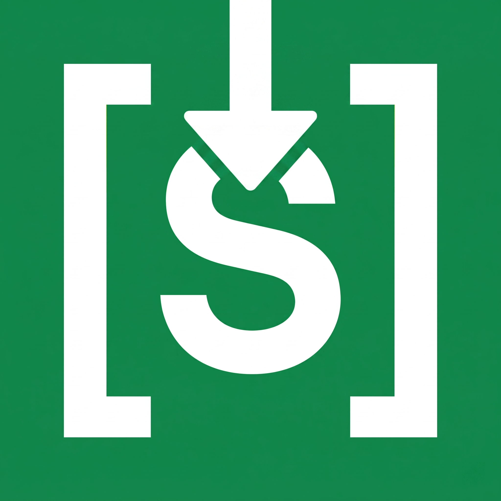
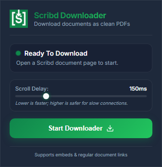

🇺🇸 English | [🇻🇳 Tiếng Việt](./README_VI.md)

  

<h1 align="center">Scribd PDF Downloader</h1>

  <b>A clean, modern, and highly-optimized Manifest V3 Chrome Extension to download Scribd documents as high-quality PDFs for free.</b>

  
  
  

The extension works by automatically redirecting document pages to their clean embed URLs, scrolling dynamically to trigger lazy-loading of all images, SVG layers, and MathJax/LaTeX equations, and formatting the page using exact CSS print sizing before invoking Chrome's native PDF printer.

---

## Preview

  

---

## Features

- **1-Click Download:** Just click the extension icon on any Scribd document to begin.
- **Auto-Redirect:** Automatically navigates standard `/document/...` and `/doc/...` links to the clean `/embeds/.../content` layout.
- **Accurate Page Counter:** Tracks and displays the exact page count using dynamic class detection (`.outer_page` or `.newpage`).
- **Dynamic CSS Sizing:** Automatically measures the dimensions of document pages in inches and injects `@page` size rules, ensuring the output PDF matches the exact layout of the original document.
- **Extra Blank Pages Avoided:** Resets page margins/paddings to zero and hides trailing loaders to prevent blank trailing pages at the end of the PDF.
- **Glassmorphic Progress UI:** Sleek dark-mode overlay showing loading status, progress percentage, and page counts.
- **No Background Redirect Blocks:** Prompts a manual "Return to Document Page" button upon completion, bypassing Chrome security restrictions on ungestured redirects.
- **No Login Required:** Works instantly without a Scribd account.

---

## Installation

Since this is an unpacked extension, you can install it manually in Google Chrome:

1. Go to the **[Releases](../../releases)** page of this repository and download the latest `scribd-pdf-downloader-v1.0.0.zip` file.
2. Extract the downloaded ZIP file to a folder on your computer.
3. Open Google Chrome and navigate to `chrome://extensions/`.
4. Enable **Developer mode** in the top-right corner.
5. Click **Load unpacked** in the top-left corner.
6. Select the extracted folder (which contains `manifest.json`).

---

## How to Use

1. Open any Scribd document page (e.g., `https://www.scribd.com/document/123456789/Document-Title`).
2. Click the **Scribd PDF Downloader** icon on your browser toolbar (you can click the puzzle icon to pin it).
3. Adjust the **Scroll Delay** slider (default: 150ms) if your internet connection is slow.
4. Click **Start Downloader**.
5. Wait for the page to finish scrolling and preparing.
6. In Chrome's print dialog, ensure **Destination** is set to **Save as PDF** and click **Save**.
7. Click **Return to Document Page** on the overlay card to go back to the original article.

---

## License

This project is licensed under the MIT License - see the [LICENSE](LICENSE) file for details.

---

## Disclaimer

This extension is for educational purposes only. Please respect copyright laws and Scribd's Terms of Service. Only download documents you have the right to access.
